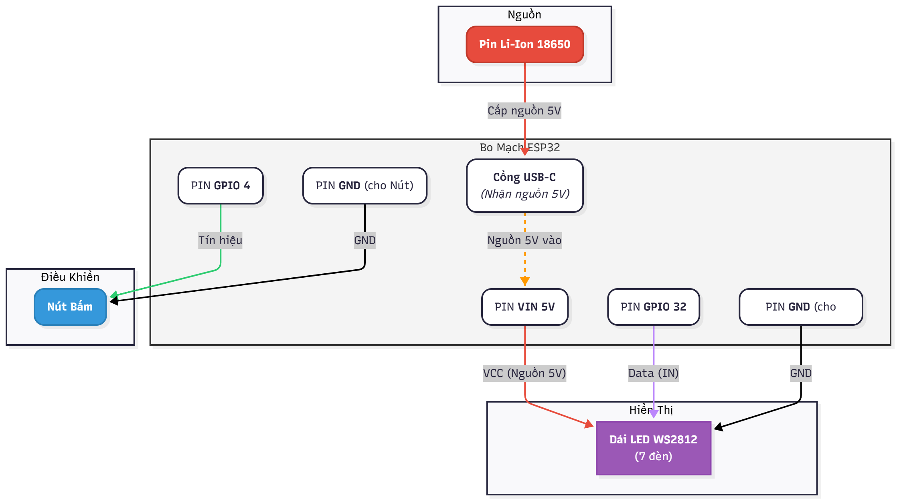
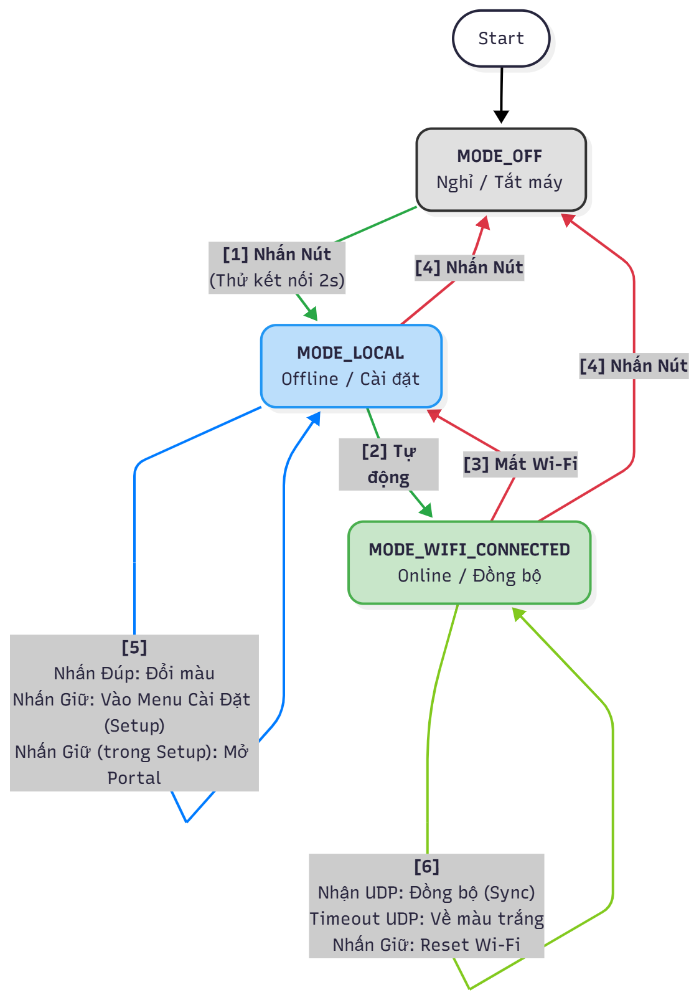
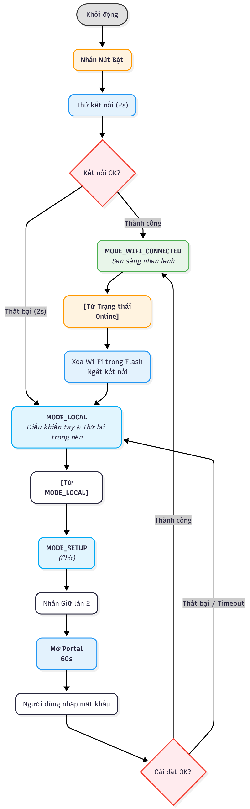

# Firmware ESP32 (Lightstick Client)
Đây là mã nguồn firmware cho Client Lightstick (ESP32), được xây dựng trên nền tảng Arduino/PlatformIO.

### 1. Sơ đồ Lắp Mạch (Phần cứng)

---

### 2. Sơ đồ Trạng Thái (State Machine)

---

### 3. Luồng Cài Đặt Mạng (WiFiManager)

